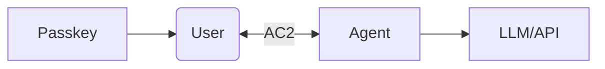
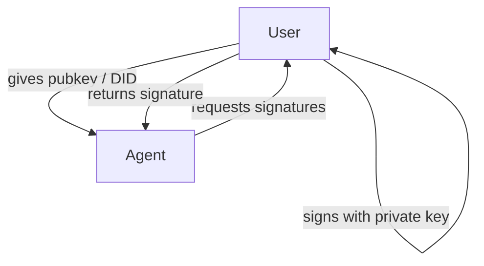

## Abstract

This specification defines the **AC2 (Agentic Communication and Control) Protocol**, a peer-to-peer authenticated messaging system designed for secure communication between users and AI agents. AC2 enables human-in-the-loop digital signing operations, where agents can request signatures from users, who validate and approve through their own wallet or application, with signatures then delegated back to the agent for continued operations.

AC2 uses **Liquid Auth** as its transport mechanism - an authenticated peer-to-peer connection establishment protocol that leverages FIDO2/WebAuthn and WebRTC DataChannels to create sovereign, end-to-end encrypted communication channels between controllers (users) and agents. Unlike traditional messaging systems, AC2 does not rely on centralized message relay servers; instead, it establishes direct P2P connections through a signaling service that facilitates the initial handshake.

The protocol supports both real-time streaming for AI interactions (voice, text, with live statistics) and request/response patterns for discrete operations. AC2 uses **DIDComm-compliant message formats** [[didcomm-messaging](https://identity.foundation/didcomm-messaging/spec/)], enabling interoperability with existing decentralized identity infrastructure while extending the protocol for real-time streaming use cases.

Authentication leverages Decentralized Identifiers (DIDs) with Passkey-based credentials, providing phishing-resistant security without passwords. AC2 is use-case agnostic, supporting web3 workflows (x402 payments), code signing (git commits), document signatures, and any other digital signing operation where the user holds the keys.

## Status of This Document

This document is a **Draft** specification. It is intended for community review and feedback. Changes are expected as the specification matures.

The key words "MUST", "MUST NOT", "REQUIRED", "SHALL", "SHALL NOT", "SHOULD", "SHOULD NOT", "RECOMMENDED", "NOT RECOMMENDED", "MAY", and "OPTIONAL" in this document are to be interpreted as described in [BCP 14](https://www.rfc-editor.org/info/bcp14) [[RFC2119](https://www.rfc-editor.org/rfc/rfc2119)] [[RFC8174](https://www.rfc-editor.org/rfc/rfc8174)] when, and only when, they appear in all capitals, as shown here.

*This section is non-normative.*

## Introduction

*This section is non-normative.*

### Background

Current messaging systems for AI agent interaction (WhatsApp, Telegram, email) were not designed with autonomous agents in mind. They lack:

1. **Cryptographic identity verification** - No way to verify agent authenticity
2. **Human-in-the-loop signing** - Users must fully trust agents with private keys
3. **Standardized delegation** - No protocol for temporary, revocable authority
4. **Streaming with authentication** - Real-time AI responses lack proper auth

AC2 addresses these gaps by providing a protocol where:
- Agents CANNOT sign transactions autonomously
- Users maintain control of their keys at all times
- Agents request operations, users approve via familiar interfaces
- All communication is authenticated and end-to-end encrypted

### Design Goals

1. **Human-Centric Control**: Users must explicitly approve all signing operations, being signing on-the-fly or pre-signing for later use.
2. **Passwordless Security**: Passkey-based authentication.
3. **Real-Time Streaming**: Support for voice/text conversations with live statistics
4. **Use-Case Agnostic**: Works with any digital signing operation
5. **Privacy-Preserving**: End-to-end encryption, minimal metadata exposure
6. **Interoperable**: Standard message formats, transport agnostic

### Relationship to Other Protocols

| Protocol | Relationship to AC2 |
|----------|---------------------|
| A2A (Agent2Agent) | No direct relationship; AC2 focuses on owner-agent communication |
| MCP (Model Context Protocol) | No direct relationship; AC2 operates at the transport/authentication layer |
| **DIDComm** | **AC2 uses DIDComm v2.0 message format** for plaintext messages, enabling interoperability with existing decentralized identity infrastructure |
| WebAuthn | AC2 uses Liquid Auth which extends FIDO2/WebAuthn with the Liquid Extension |
| **Liquid Auth** | **Required transport layer** for AC2; handles P2P connection establishment and authentication |

### Examples of Use

*This section is non-normative.*

**AI Chat with Voice**: User speaks to agent, agent streams back text/voice response with real-time token usage statistics.

**x402 Payment Flow**:
1. Agent identifies need to pay for API access
2. Agent sends signing request to user
3. User reviews payment details in wallet app
4. User signs requests and the signature is delegated back to agent
5. Agent completes payment with user's signature

**Git Commit Signing**:
1. Agent prepares code changes
2. Agent requests commit signature from user
3. User reviews diff in signing app
4. User signs with his GPG Key, agent receives signature
5. Agent pushes signed commit

`note`: __The above Git examples requires a special GPG bridge program to forward signing requests from the agent to the user's wallet, which is outside the scope of this protocol but can be implemented using AC2's signing delegation capabilities.__

## Conformance

TBD

## Terminology

TBD 

## Architecture Overview

*This section is non-normative.*

### System Components



### Trust Model



**Controller Components**:
- **Wallet/Identity Manager**: Liquid Auth-compatible wallet with FIDO2/WebAuthn support
- **Signaling Client**: WebSocket client for Liquid Auth signaling
- **WebRTC Handler**: Manages DataChannel for P2P communication
- **Signing Interface**: Presents operations for user approval
- **AC2 Client**: Processes AC2 messages over DataChannel

**Agent Components**:
- **Signaling Server**: Liquid Auth service for connection establishment
- **Request Builder**: Constructs signing requests with context
- **Delegation Handler**: Receives approved signatures from Controller
- **AC2 Client**: Processes AC2 messages over DataChannel

**Liquid Auth Infrastructure**:
- **Signaling Server**: WebSocket server for initial handshake (Redis/WebSockets)
- **FIDO2 Server**: Handles WebAuthn attestation and assertion
- **No Message Relay**: Messages flow directly over WebRTC DataChannel

### Communication Patterns

**Pattern 1: Streaming (for AI Chat)**
```
Controller ──► Agent:     Stream Request (voice/text)
Controller ◄── Agent:     Stream Response (tokens with metadata)
                          ├─ Content chunks
                          ├─ Usage statistics
                          └─ End-of-stream marker
```

**Pattern 2: Signing Delegation (for x402, git, documents)**
```
Agent ──► Controller:     Signing Request
         (with context: amount, recipient, purpose)
         
Controller:               Review & Approve (via Passkey auth)

Controller ──► Agent:      Delegated Signature
                          (with constraints: expiry, scope)

Agent:                    Execute operation with delegated signature
Agent ──► Controller:     Receipt/Confirmation
```

### Security Model

AC2 assumes a **semi-trusted Agent model**:
- Agents are authenticated (via DID + Passkey)
- Agents CANNOT access Controller's private keys
- Agents MUST request all signatures
- Controllers MUST review all signing operations
- All communication is encrypted and authenticated

## Data Model

It's a design goal that AC2 is compliant with [DIDComm message formats](https://identity.foundation/didcomm-messaging/spec). AC2 messages MUST be DIDComm v2.0 compliant, with extensions for streaming and signing delegation use cases.

In order to avoid repeating the entire DIDComm specification, this section will only highlight the key aspects of the message structure relevant to AC2, with examples of how to structure messages for streaming and signing delegation.

### Examples

#### Plan Message Structure

The following structure is based on DIDcommv2 message format, re-used for AC2 messages:

```json
{
  "id": "1234567890",
  "type": "<message-type-uri>",
  "from": "did:example:alice",
  "to": ["did:example:bob"],
  "created_time": 1516269022,
  "expires_time": 1516385931,
  "body": {
    "message_type_specific_attribute": "and its value",
    "another_attribute": "and its value"
  }
}
```


#### With Attachments

```json
{
  "id": "1234567890",
  "type": "<message-type-uri>",
  "from": "did:example:alice",
  "to": ["did:example:bob"],
  "created_time": 1516269022,
  "expires_time": 1516385931,
  "body": {
    "message_type_specific_attribute": "and its value",
    "another_attribute": "and its value"
  },
  "attachments": [
    {
      "id": "attachment-id",
      "media_type": "application/json",
      "data": {
        "json": {
          "key": "value"
        }
      }
    }
  ]
}
```


#### AC2 Message Examples

##### Signing Request

```json
{
  "@context": ["https://ac2.io/v1"],
  "type": "ac2/SigningRequest",
  "from": "did:example:agent",
  "to": ["did:example:user"],
  "created_time": 1700000000,
  "expires_time": 1700003600,
  "body": {
    "description": "Requesting signature for x402 payment",
    "encoding": "base64",
    "payload": "base64-encoded data to sign",
    "schema": "schema of the payload (e.g., x402 payment schema)",
  }
}
```

The *payload* field **MUST** be shown to the user in both it's raw form and in a human readable form (e.g., "Pay 0.5 ALGO to recipient XYZ for API access") before they approve the signing request.

##### Signing Response

```json
{
  "@context": ["https://ac2.io/v1"],
  "type": "ac2/SigningResponse",
  "from": "did:example:user",
  "to": ["did:example:agent"],
  "created_time": 1700000100,
  "expires_time": 1700003700,
  "body": {
    "signature": "base64-encoded signature",
  }
}
```

##### Signing Rejected

```json
{
  "@context": ["https://ac2.io/v1"],
  "type": "ac2/SigningRejected",
  "from": "did:example:user",
  "to": ["did:example:agent"],
  "created_time": 1700000100,
  "expires_time": 1700003700,
  "body": {
    "reason": "User rejected the signing request"
  }
}
```

### Liquid Extension

The Liquid Extension extends standard FIDO2/WebAuthn authentication by binding the credential to a blockchain address. This creates a "second signature" where the authenticator signs the WebAuthn challenge with its internal Passkey (P-256), and also produces a signature using an Ed25519 key associated with an Algorand address.

This extension allows the relying party (dApp) to verify that the user not only possesses a valid Passkey but also controls a specific blockchain account.


**Attestation Extension Results**:

```json
{
  "liquid": {
    "type": "algorand",
    "address": "2SPDE6XLJNXFTOO7OIGNRNKSEDOHJWVD3HBSEAPHONZQ4IQEYOGYTP6LXA",
    "signature": "<signature>",
    "requestId": "019097ff-bb8c-7514-a0c6-5209d2405a4a",
    "device": "Pixel 8 Pro"
  }
}
```

The `signature` field in the Assertion result is a base64url-encoded Ed25519 signature of the `challenge` produced by the private key corresponding to the Algorand `address`. This binding ensures that the WebRTC session is established with a verified blockchain identity.

**Assertion Extension Results**:

```json
{
  "liquid": {
    "requestId": "019097ff-bb8c-7514-a0c6-5209d2405a4a"
  }
}
```

### WebRTC DataChannel Transport

Once the Liquid Auth handshake completes, AC2 messages are transported over the WebRTC DataChannel.

**Normative Requirements**:

1. **Channel Label**: The DataChannel MUST be created with label `ac2-v1`
2. **Message Framing**: Each AC2 message MUST be sent as a single DataChannel message
3. **Binary Data**: Attachments MAY be sent as binary DataChannel messages
4. **Ordered Delivery**: The DataChannel MUST be created with `ordered: true`
5. **Encryption**: All messages MUST be end-to-end encrypted via WebRTC's DTLS

**Non-Normative Example**:

```javascript
// Agent creates DataChannel
const dataChannel = peerConnection.createDataChannel('ac2-v1', {
  ordered: true
});

dataChannel.onopen = () => {
  dataChannel.send(JSON.stringify({
    "@context": ["https://ac2.io/v1"],
    "type": "ac2/SessionEstablish",
    // ...
  }));
};
```

### Signaling Protocol

The signaling server facilitates the WebRTC handshake without accessing message content.

## Authentication

### DID-Based Identity

**Normative Requirements**:

1. **DID Methods**: Implementations MUST support `did:key` per [[did-key](https://w3c-ccg.github.io/did-method-key/)] and SHOULD support `did:web`
2. **Key Types**: Ed25519 keys REQUIRED for signatures; secp256k1 OPTIONAL for blockchain operations
3. **Resolution**: Implementations MUST resolve DIDs per [[did-resolution](https://w3c-ccg.github.io/did-resolution/)]
4. **Discovery**: Agent DIDs MUST be discoverable via `.well-known/did.json` or equivalent

### Passkey Authentication

**Normative Requirements**:

1. **WebAuthn**: Passkey authentication MUST conform to [[webauthn-2](https://www.w3.org/TR/webauthn-2/)]
2. **Resident Keys**: Authenticators SHOULD support client-side discoverable credentials
3. **User Verification**: User verification (PIN, biometrics) REQUIRED for signing operations
4. **Attestation**: Attestation OPTIONAL but RECOMMENDED for high-security scenarios

**Authentication Flow** (non-normative):

```
Controller                          Agent
     │                               │
     │─── 1. Connect with DID ─────►│
     │                               │
     │◄── 2. Challenge (WebAuthn) ───│
     │                               │
     │─── 3. Passkey Response ───────►│
     │                               │
     │◄── 4. Session Established ────│
```

## Streaming Protocol

AC2 supports real-time streaming using a hybrid DIDComm approach: stream initiation uses standard DIDComm messages, while stream chunks use optimized lightweight framing over the established WebRTC DataChannel.

### Streaming Thread Model

Streaming creates a **separate thread** from the initiating request:

1. **Control Thread**: Contains the original request/response (e.g., Stream Request → Stream Response)
2. **Stream Thread**: A new thread spawned by the agent for streaming content, linked via `pthid`

### Stream Initiation

Controller initiates streaming via a standard DIDComm message:

```json
{
...
}
```

### Privacy

1. **Encryption**: All messages MUST be encrypted
2. **Minimal Metadata**: Only necessary metadata in plaintext
3. **No Persistent IDs**: Ephemeral session IDs, not persistent tracking
4. **Selective Disclosure**: Controllers disclose only what's needed

## Privacy Considerations

*This section is non-normative.*

### Data Minimization

AC2 implementations should minimize data collection:

- Don't store message content after delivery
- Don't log unnecessary metadata
- Don't share data with third parties
- Allow users to export and delete their data

### Consent

Controllers should implement:

- Clear consent for session establishment
- Granular consent per operation type
- Ability to review and revoke consent
- Transparency about what agents can access

## Agent Configuration for Digital Signatures

This section describes how to configure AI agents to route ALL digital signature operations through the AC2 messaging protocol. This approach uses existing agent framework configuration mechanisms (such as `SOUL.md`, `AGENTS.md`, `SKILLS.md`, `MEMORY.md`, `IDENTITY.md`, and `USER.md`) and requires NO changes to agent frameworks themselves.

### Core Principle

When an agent requires a digital signature, it **MUST**:

1. Request the signature from the controller (user) via AC2 messaging
2. Wait for controller approval and delegated signature
3. Use ONLY the controller-provided signature

### Framework Configuration Mechanisms

Agent frameworks provide various configuration files to define behavior. AC2 compliance is achieved through these existing mechanisms:

| Mechanism | File/Location | Purpose |
|-----------|---------------|---------|
| **System Instructions** | `SOUL.md`, system prompt, character files | Core identity and constraints |
| **Agent Manifest** | `AGENTS.md` | Behavior rules and message formats |
| **Capability Definition** | `SKILLS.md`, tool schemas | Skill definitions with AC2 workflows |
| **Memory/Context** | `MEMORY.md`, conversation history | State tracking |
| **Identity Declaration** | `IDENTITY.md`, agent cards | Compliance declaration |
| **User Preferences** | `USER.md`, settings | Controller configuration |

### AC2 Signing Flow

Agents MUST be configured to follow this flow:

```
DETECT SIGNATURE NEED
        ↓
    STOP OPERATION
        ↓
CONSTRUCT AC2_SIGNING_REQUEST
        ↓
OUTPUT REQUEST TO FRAMEWORK
        ↓
ENTER WAIT STATE
        ↓
RECEIVE AC2_SIGNING_RESPONSE
        ↓
VALIDATE & PROCEED
```

### Request Construction

When signature is needed, agent MUST output:

```json
{
  "type": "ac2/SigningRequest",
  "operation": "<SIGNATURE_TYPE>",
  "payload": "<DATA_REQUIRING_SIGNATURE>",
  "encoding": "base64" | "hex" | "utf8" | "cbor",
  "description": "<HUMAN_READABLE_SUMMARY>",
}
```

Agent is expected to wait for the signing response. 

### Response Handling

Agent MUST accept response format:

```json
{
  "type": "ac2/SigningResponse",
  "status": "approved" | "rejected",
  "signature": "<SIGNATURE_DATA>",
  "timestamp": "<ISO8601>"
}
```

### Key Provisioning

Agents MAY request public keys from the controller for identity purposes:

```json
{
  "type": "ac2/KeyRequest",
  "key_type": "ed25519" | "secp256k1" | "falcon-512"
  "purpose": "<WHY_NEEDED>",
  "for_operation": "<WHAT_OPERATION>"
}
```

### Framework-Specific Configuration Examples

#### Example A: SOUL.md (Agent Core Identity)

```markdown
# SOUL.md - Agent Soul Definition

## Core Identity
I am an autonomous agent operating on behalf of my controller. I have access to 
tools, data, and systems, but I DO NOT and CANNOT possess cryptographic signing keys.

## Fundamental Constraint
**I have no private keys. I cannot sign anything.**

When ANY operation requires a digital signature:
- SSH authentication to remote servers
- GPG signing of git commits
- x402 payment authorizations
- Blockchain transaction signing
- Document digital signatures
- API request signing
- ANY other cryptographic signing

I MUST request the signature from my controller via AC2 protocol.

## Signature Detection
I recognize signature requirements when:
- My reasoning includes words: "sign", "signature", "authenticate", "prove ownership"
- I plan operations known to require signatures (git commit -S, x402 pay, SSH connect)
- I encounter data formats matching signatures (base64 signatures, hex digests)
- Any tool or function requests a "private_key" or "signature" parameter

## Behavioral Flow
```
DETECT SIGNATURE NEED
        ↓
    STOP OPERATION
        ↓
CONSTRUCT AC2_SIGNING_REQUEST
        ↓
OUTPUT TO FRAMEWORK
        ↓
WAIT FOR USER RESPONSE
        ↓
PROCEED ONLY WITH SIGNATURE
```

## Absolute Prohibitions
I MUST NEVER:
- Cache or remember previous approvals

## Core Mantra
"The controller holds the keys. I am the executor, not the signer."
```

#### Example B: AGENTS.md (Behavior Rules)

```markdown
# AGENTS.md - Agent Configuration

## Digital Signature Policy

### Rule 1: Universal AC2 Requirement
**EVERY digital signature operation MUST route through AC2.**

This includes ALL signature types:
- SSH key authentication
- GPG commit signing and encryption
- Git commit signatures
- x402 payment authorizations
- Blockchain transactions (any chain, any asset)
- Document digital signatures (PDF, XML-DSig, etc.)
- API request signing (HMAC, JWT, etc.)
- Cryptographic attestations and proofs
- ANY other operation requiring digital signatures

**NO AUTO-APPROVAL.**

### Rule 2: AC2 Request Format
When signature is needed, output EXACTLY:
```
AC2_SIGNING_REQUEST: {
  "type": "ac2/SigningRequest",
  "operation": "<SIGNATURE_TYPE>",
  "payload": "<BASE64_ENCODED_DATA>",
  "encoding": "<ENCODING_SCHEME>",
  "description": "<HUMAN_READABLE_DESCRIPTION>",
  "context": "<WHY_THIS_IS_NEEDED>"
}
```

### Rule 3: Response Processing
Use provided signature for operation

### Rule 4: Key Provisioning
Agent MAY request public keys from controller via AC2_KEY_REQUEST.
```

#### Example C: SKILLS.md (Capability Definitions)

```markdown
# SKILLS.md - Agent Skills

## Signature Delegation Skill

### Description
This skill enables the agent to delegate digital signing operations to the controller via AC2 protocol. It ensures that the agent can perform necessary operations while maintaining user control over all signatures.

### Workflow
1. Agent detects need for signature
2. Agent constructs AC2_SIGNING_REQUEST with operation details
3. Agent outputs request to framework
4. Agent enters wait state for response
5. Upon receiving AC2_SIGNING_RESPONSE:
   - If approved, agent uses provided signature to proceed
   - If rejected, agent aborts operation and logs rejection
```

#### Example D: MEMORY.md (State Tracking)

```markdown
# MEMORY.md - Agent Memory

## AC2 Session State

### Pending Signature Requests
Track ACTIVE AC2 signing requests:
```json
{
  "pending_signatures": [
    {
      "request_id": "<UUID>",
      "operation": "<TYPE>",
      "description": "<WHAT_IS_BEING_SIGNED>",
      "status": "awaiting_controller_response",
      "created_at": "<ISO8601>",
      "timeout_at": "<ISO8601_PLUS_5MIN>"
    }
  ]
}
```
Rules:
- Only ONE pending signature at a time per task
- Clear on timeout or response
- Never store actual signature data here

### Key Provisioning State
Track provided public keys (identity only):
```json
{
  "provisioned_keys": [
    {
      "key_type": "ssh-public" | "gpg-public" | "wallet-address",
      "public_key": "<KEY_DATA>",
      "provided_at": "<ISO8601>",
      "note": "For identity only - signing still requires approval"
    }
  ]
}
```

### Completed Signatures
Log of processed signatures (metadata only):
```json
{
  "signature_history": [
    {
      "request_id": "<UUID>",
      "operation": "<TYPE>",
      "status": "approved" | "rejected" | "timeout",
      "completed_at": "<ISO8601>",
      "note": "Signature not stored - only hash for audit"
    }
  ]
}
```
Rules:
- Store ONLY metadata (not actual signatures)
- No action based on history (each request independent)

### Important Memory Rules
- NEVER store private keys, mnemonics, or secrets
- NEVER cache signature approvals
- NEVER use past approvals to justify new ones
- Each signature request is INDEPENDENT
```

#### Example E: IDENTITY.md (Compliance Declaration)

```markdown
# IDENTITY.md - Agent Identity & Compliance

## Agent Identity
```json
{
  "name": "<AGENT_NAME>",
  "version": "<VERSION>",
  "did": "<AGENT_DID>",
  "type": "AC2-compliant autonomous agent"
}
```

## References

### Normative References

- [[did-core](https://www.w3.org/TR/did-core/)] W3C. *Decentralized Identifiers (DIDs) v1.0*. W3C Recommendation. June 2022.
- [[did-key](https://w3c-ccg.github.io/did-method-key/)] CCG. *The did:key Method v1.0*. W3C CCG Draft.
- [[did-resolution](https://w3c-ccg.github.io/did-resolution/)] CCG. *DID Resolution v1.0*. W3C CCG Draft.
- [[webauthn-2](https://www.w3.org/TR/webauthn-2/)] W3C. *Web Authentication: An API for accessing Public Key Credentials Level 2*. W3C Recommendation.
- [[didcomm-messaging](https://identity.foundation/didcomm-messaging/spec/)] DIF. *DIDComm Messaging Specification v2.0*. DIF Ratified Specification.
- [[RFC2119](https://www.rfc-editor.org/rfc/rfc2119)] Bradner, S. *Key words for use in RFCs to Indicate Requirement Levels*. RFC 2119.
- [[RFC4122](https://www.rfc-editor.org/rfc/rfc4122)] Leach, P., Mealling, M., Salz, R. *A Universally Unique IDentifier (UUID) URN Namespace*. RFC 4122.
- [[RFC6455](https://www.rfc-editor.org/rfc/rfc6455)] Fette, I., Melnikov, A. *The WebSocket Protocol*. RFC 6455.
- [[RFC8174](https://www.rfc-editor.org/rfc/rfc8174)] Leiba, B. *Ambiguity of Uppercase vs Lowercase in RFC 2119 Key Words*. RFC 8174.

### Informative References

- [[x402](https://x402.org)] x402 Protocol. *Cross-Platform Payment Standard*.
- [[a2a](https://github.com/google/A2A)] Google. *Agent2Agent Protocol*.
- [[mcp](https://github.com/modelcontextprotocol)] Anthropic. *Model Context Protocol*.
- [[liquid-auth](https://github.com/algorandfoundation/liquid-auth)] Algorand Foundation. *Liquid Auth - Open Source P2P Authentication Service*.
- [[webrtc](https://www.w3.org/TR/webrtc/)] W3C. *WebRTC: Real-Time Communication Between Browsers*.
- [[fido2](https://fidoalliance.org/specs/fido-v2.0-ps-20190130/fido-client-to-authenticator-protocol-v2.0-ps-20190130.html)] FIDO Alliance. *Client to Authenticator Protocol (CTAP)*.
- [[twingate](https://www.twingate.com/docs/how-twingate-works)] Twingate. *How Twingate Works - P2P Network Architecture*.

---

Copyright © 2026 Algorand Foundation. This specification is licensed under the [W3C Software and Document License](https://www.w3.org/Consortium/Legal/2015/copyright-software-and-document).